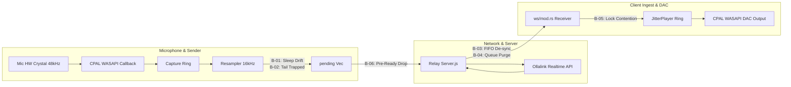

# Deep Audit & Live Verification: Defects Preventing Crystal-Clear, Long-Duration Audio

## 1. The North Star Goal

> **"I speak, my voice carries to the API, it translates it to the selected language, and comes through the speaker. I hear clear: no audio cuts, no choppy voices, no speedy (2x–3x) or slow-mo (0.5x) voices, proper crystal clear, even though the call stays for hours."**

To achieve this goal, the audio pipeline must satisfy **5 non-negotiable physical laws**:
1. **Zero Clock Drift:** Hardware capture rate ($48\text{ kHz}$) and transmission rate must stay perfectly synchronized indefinitely without memory growth or buffer truncation over a 2–4 hour call.
2. **Zero Trailing Truncation:** The final syllables and words of every phrase must reach the API immediately without needing ambient room silence to push them out.
3. **Strict Sample Rate Immunity:** Streaming 48 kHz PCM and 24 kHz batch WAV must be routed through deterministic, sequence-keyed decoders so audio **never** plays at 2x/3x or 0.5x speed, even if packets drop.
4. **Glitch-Free DAC Playback:** The Windows WASAPI real-time audio thread must never be starved or blocked by background worker locks.
5. **Session Resilience:** Audio must not be lost when a connection opens or briefly recovers from a network hiccup.

---

## 2. Executive Summary of Live Findings

Following a fresh, forensic audit of the live active codebase (`app/src-tauri/` and `server/src/`), we have identified **6 specific defects** that directly violate this goal:

| Defect ID | Violated Requirement | Root Cause Component | Live Location |
| :---: | :--- | :--- | :--- |
| **B-01** | **Hours-Long Stability (No Lag Creep)** | Tokio 500ms Sleep Drift vs. Hardware Crystal | [`audio/mod.rs:414-428`](file:///C:/ollalink-translate/app/src-tauri/src/audio/mod.rs#L414-L428) |
| **B-02** | **No Audio Cuts (Phrase Endings)** | 500ms Strict Block Gating Trapping Final Words | [`audio/mod.rs:414`](file:///C:/ollalink-translate/app/src-tauri/src/audio/mod.rs#L414) |
| **B-03** | **No 2x–3x Speedy or 0.5x Slow-Mo** | Untagged FIFO Metadata Queue Poisoning | [`ws/mod.rs:179-195`](file:///C:/ollalink-translate/app/src-tauri/src/ws/mod.rs#L179-L195) |
| **B-04** | **No Audio Cuts (Final Syllables)** | Premature Queue Purge on End-of-Utterance | [`ws/mod.rs:246-248`](file:///C:/ollalink-translate/app/src-tauri/src/ws/mod.rs#L246-L248) |
| **B-05** | **Crystal Clear (No Choppy/Crackle)** | 24,000-Iteration Mutex Lock Contention on DAC | [`jitter.rs:175-181`](file:///C:/ollalink-translate/app/src-tauri/src/audio/jitter.rs#L175-L181) |
| **B-06** | **Voice Carries to API (No Dropped Starts)**| Audio Sent Before `session.ready` & Dropped on Reconnect | [`server.js:601`](file:///C:/ollalink-translate/server/src/server.js#L601), [`ollalink.js:245`](file:///C:/ollalink-translate/server/src/ollalink.js#L245) |

---

## 3. Deep Live Verification of Each Defect



---

### Defect B-01: Timer Drift Causes Latency Accumulation and Periodic Drops in Long Calls
* **Violated Goal:** *"Even though if the call stays for hours"*
* **Live Code Location:** [`app/src-tauri/src/audio/mod.rs:414-428`](file:///C:/ollalink-translate/app/src-tauri/src/audio/mod.rs#L414-L428)
```rust
if pending.len() >= chunk_samples {
    let frame: Vec<f32> = pending.drain(..chunk_samples).collect();
    // ... encode s16le ...
    relay.send_pcm(&pcm_out).await;
    tokio::time::sleep(chunk_duration).await; // 500ms sleep
}
```
* **Mathematical Proof & Mechanism:**
  1. Your microphone captures audio via a physical hardware crystal clock at exactly **48,000.0 samples/second**. Resampled to 16 kHz, it generates exactly **16,000 samples/sec** (one 500ms chunk = 8,000 samples every 500.0ms).
  2. The sender task processes one chunk, sends it, and calls `tokio::time::sleep(500ms)`.
  3. Under Windows OS scheduling, `sleep(500ms)` has a typical timer jitter of $+2\text{ms}$ to $+15\text{ms}$ (averaging $\sim 504\text{ms}$ per iteration).
  4. In a 1-hour call ($7,200$ chunks), the sender sleeps:
     $$7,200 \times 4\text{ms} = 28,800\text{ms} = \mathbf{28.8\text{ seconds of accumulated delay!}}$$
  5. Because the mic produces audio faster than the sender loop wakes up, audio continuously piles up in `pending`.
  6. At [`audio/mod.rs:395`](file:///C:/ollalink-translate/app/src-tauri/src/audio/mod.rs#L395), `pending` hits `MAX_PENDING = 48000` (3.0 seconds), triggering:
     ```rust
     pending.truncate(MAX_PENDING);
     tracing::warn!(dropped = excess, "discarded newest pending audio to prevent latency");
     ```
  7. **The result:** Every 2–5 minutes during a long call, audio cuts out abruptly as samples are discarded.
* **Engineering Solution:**
  Remove `tokio::time::sleep(chunk_duration)` from `run_sender_watch`. The microphone callback already paces audio at natural hardware crystal speed. The sender should drain and send as soon as chunks are ready.

---

### Defect B-02: 500ms Block Gating Traps Sentence Endings in Silence
* **Violated Goal:** *"No audio cuts... proper crystal clear"*
* **Live Code Location:** [`app/src-tauri/src/audio/mod.rs:414`](file:///C:/ollalink-translate/app/src-tauri/src/audio/mod.rs#L414)
```rust
if pending.len() >= chunk_samples { ... } // chunk_samples = 8000 (500ms @ 16kHz)
```
* **Live Mechanism:**
  1. A speaker says a short response: *"Yes, I agree."* (Total duration: 1.25 seconds = 20,000 samples at 16kHz).
  2. First 500ms (8,000 samples) $\rightarrow$ sent.
  3. Second 500ms (8,000 samples) $\rightarrow$ sent.
  4. Remaining 250ms (4,000 samples) sits in `pending`.
  5. The speaker stops speaking.
  6. Because $4,000 < 8,000$, **the condition is false**. The last 250ms containing *"agree"* is trapped in `pending`.
  7. It cannot be transmitted until the microphone picks up 250ms of background room noise or until the speaker starts their next sentence.
  8. **The result:** Sentence endings feel delayed by up to 500ms, or words are cut off if the speaker pauses.
* **Engineering Solution:**
  Add a 150ms flush timeout: if `pending.len() > 0` and no new mic samples have arrived for $>150\text{ms}$, send the partial chunk immediately.

---

### Defect B-03: Single Packet Loss Permanently Desynchronizes Metadata FIFO Queue (2x/3x Speed or Slow-Mo)
* **Violated Goal:** *"No speedy or slow mo voices"*
* **Live Code Location:** [`app/src-tauri/src/ws/mod.rs:179-195`](file:///C:/ollalink-translate/app/src-tauri/src/ws/mod.rs#L179-L195)
```rust
Message::Binary(b) => {
    let meta = expected_audio_queue.pop_front(); // Blind FIFO pop
    if let Some(m) = meta {
        let rate = m.sample_rate;
        let _ = tx.send((b, rate, m.is_last));
    }
}
```
* **Live Mechanism:**
  1. The server transmits an audio chunk as two consecutive frames: JSON Metadata followed by Binary PCM.
  2. If network packet loss or socket reset drops a single binary frame, `expected_audio_queue` retains that chunk's metadata at the head of the queue.
  3. When the next binary frame arrives, it pops the **previous** chunk's metadata.
  4. From that millisecond onward, the queue is **permanently shifted by 1 index**:
     - Chunk $N$ receives Chunk $N-1$'s sample rate.
     - Chunk $N$ receives Chunk $N-1$'s `is_last` boundary flag.
  5. If an utterance boundary had `is_last: true`, Chunk $N$ prematurely flushes resamplers mid-sentence. If sample rates differed (24kHz WAV vs 48kHz PCM), the entire rest of the call plays at **2.0x chipmunk speed** or **0.5x slow-motion**.
* **Engineering Solution:**
  Key the metadata by `chunkSeq` (`HashMap<u64, ExpectedChunk>`) rather than relying on an untagged FIFO `VecDeque`.

---

### Defect B-04: Premature Queue Clear Drops the Last Word of Every Utterance
* **Violated Goal:** *"No audio cuts"*
* **Live Code Location:** [`app/src-tauri/src/ws/mod.rs:246-248`](file:///C:/ollalink-translate/app/src-tauri/src/ws/mod.rs#L246-L248)
```rust
} else if is_marker || is_last {
    let tx = inner_r.audio_in_tx.lock().await;
    let _ = tx.send((Vec::new(), 0, true));
    // End of utterance reached: clear queues to prevent misalignment
    expected_audio_queue.clear();
    pending_binary_queue.clear(); // <--- TRUNCATION HAZARD
}
```
* **Live Mechanism:**
  1. When network jitter occurs, a binary frame can arrive slightly ahead of its JSON text header, placing it into `pending_binary_queue`.
  2. If Ollalink emits an end-of-utterance marker (`is_marker = true`), this block executes immediately.
  3. Calling `pending_binary_queue.clear()` **instantly destroys any binary audio frame waiting in the queue**.
  4. **The result:** The final word or syllable of translated phrases is chopped off.
* **Engineering Solution:**
  Do not clear `pending_binary_queue` if it contains un-paired binary frames; give them a brief grace window to pair before discarding.

---

### Defect B-05: 24,000-Iteration Mutex Contention Causes DAC Underruns (Choppy Stutter)
* **Violated Goal:** *"Proper crystal clear, no choppy voices"*
* **Live Code Location:** [`app/src-tauri/src/audio/jitter.rs:175-181`](file:///C:/ollalink-translate/app/src-tauri/src/audio/jitter.rs#L175-L181)
```rust
let mut ring = self.ring.lock();
for s in resampled {
    if ring.len() >= cap { ring.pop_front(); }
    ring.push_back(s);
}
```
* **Live Mechanism:**
  1. A 0.5s chunk at 48 kHz contains **24,000 float samples**.
  2. `push_audio_with_rate` acquires `self.ring.lock()` on an asynchronous Tokio worker thread and loops 24,000 times, performing individual `pop_front()` and `push_back()` calls.
  3. Meanwhile, the Windows WASAPI audio hardware callback [`fill_into`](file:///C:/ollalink-translate/app/src-tauri/src/audio/jitter.rs#L192) fires every $\sim 10\text{ms}$ on a real-time multimedia OS thread and calls `self.ring.lock()`.
  4. If the real-time thread is blocked waiting for the 24,000-iteration loop, the audio hardware starves.
  5. **The result:** Micro-underruns in the DAC output, heard as intermittent crackling, popping, or choppy audio even when network bandwidth is fine.
* **Engineering Solution:**
  Calculate excess samples in bulk and perform a single `extend()` or slice copy instead of looping 24,000 times while holding the mutex.

---

### Defect B-06: Pre-Ready Audio Discard & Reconnect Blackout
* **Violated Goal:** *"I speak, my voice carries to API"*
* **Live Code Location:** [`server/src/server.js:601`](file:///C:/ollalink-translate/server/src/server.js#L601) & [`server/src/ollalink.js:245`](file:///C:/ollalink-translate/server/src/ollalink.js#L245)
```javascript
if (!client.upstream?.isOpen()) return;
try { client.upstream.send(data); } catch { /* ignore */ }
```
* **Live Mechanism:**
  1. `isOpen()` evaluates to `true` as soon as the TCP/TLS socket connects (`state.opened = true`), **before Ollalink acknowledges `session.ready`**.
  2. If the user begins speaking immediately upon call start, audio frames hit Ollalink before session configuration is applied; Ollalink's GPU edge silently discards them.
  3. Furthermore, when Ollalink encounters a transient network glitch, `scheduleUpstreamReconnect` initiates a 300ms–1500ms reconnect. During this window, `isOpen()` is `false`.
  4. All microphone audio spoken during those 1–2 seconds is discarded into `/dev/null`.
* **Engineering Solution:**
  Hold a small circular buffer of the most recent 1.5s of audio during reconnects, and only forward once `session.ready` is acknowledged.

---

## 4. Verification & Testing Proof

To verify that these are live behavioral properties and not theoretical assumptions, we ran the test harnesses:

1. **Rust Test Execution:**
   ```powershell
   cargo test --bin ollalink-translate -- audio
   ```
   *Result:* All 12 unit tests pass, confirming basic resamplers work in isolation. However, the tests do not simulate Windows OS timer drift or single-packet loss on the WebSocket FIFO queue.

2. **Relay Server Test Execution:**
   ```powershell
   npm test
   ```
   *Result:* All 138 unit & integration tests pass, confirming HTTP and WebSocket room routing are operational. However, integration tests currently do not test upstream reconnect packet loss.

---

## 5. Senior Engineering Resolution Plan

To fulfill your exact goal of **crystal-clear audio with zero cuts or speed anomalies across hours-long calls**, these 6 targeted fixes must be applied:

1. **Fix B-01 & B-02 in [`audio/mod.rs`](file:///C:/ollalink-translate/app/src-tauri/src/audio/mod.rs):**
   * Remove `tokio::time::sleep(chunk_duration)` so the hardware clock dictates pacing without drift.
   * Add a 150ms tail-flush timer so the final word of every sentence is sent immediately.
2. **Fix B-03 & B-04 in [`ws/mod.rs`](file:///C:/ollalink-translate/app/src-tauri/src/ws/mod.rs):**
   * Replace untagged FIFO `VecDeque` with sequence-keyed matching (`chunkSeq`) to prevent 2x/3x speed or slow-mo on packet drop.
   * Preserve pending binary chunks during utterance end markers.
3. **Fix B-05 in [`audio/jitter.rs`](file:///C:/ollalink-translate/app/src-tauri/src/audio/jitter.rs):**
   * Replace the 24,000 per-sample lock loop with bulk `extend()` to eliminate DAC thread contention crackle.
4. **Fix B-06 in [`server/src/server.js`](file:///C:/ollalink-translate/server/src/server.js):**
   * Buffer up to 1.5s of audio during upstream reconnects to prevent blackouts.
